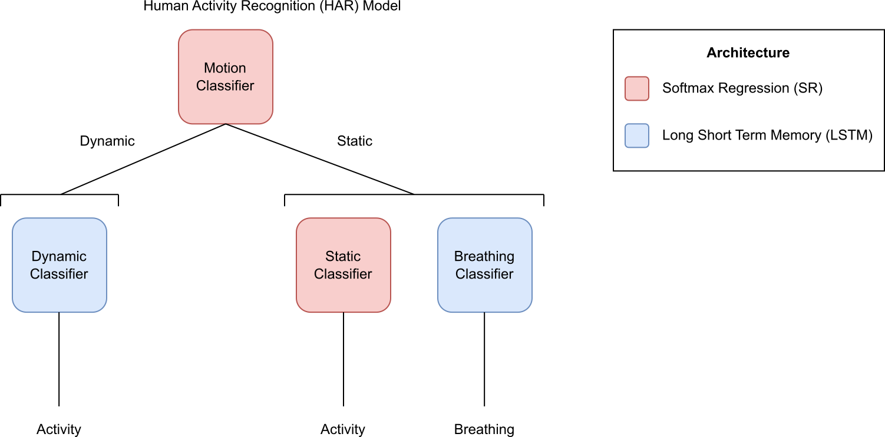

# IMU Activity Recognition for Android

IMU Activity Data: https://github.com/specknet/pdiot-data

## Structure




**SR** - Softmax Regression

**MLP** - Multilayer Perceptron

**CNN** - Convolutional Neural Network

**LSTM** - Long Short-Term Memory


#### TASK 1: CLASSIFICATION OF GENERAL HUMAN ACTIVITIES
*Only use data collected during normal breathing!*
```
class 0: sitting/standing
class 1: lying down on your left side
class 2: lying down on your right side
class 3: lying down on your back
class 4: lying down on your stomach
class 5: walking
class 6: running/jogging
class 7: descending stairs
class 8: ascending stairs
class 9: shuffle walking
class 10: miscellaneous movements 
```

#### TASK 2: CLASSIFICATION OF STATIONARY ACTIVITIES WITH RESPIRATORY SYMPTOMS
*Do not include any data files/recordings that contain laughing, singing, eating, or talking!*
```
class 0: sitting/standing + breathing normally
class 1: lying down on your left side + breathing normally
class 2: lying down on your right side + breathing normally
class 3: lying down on your back + breathing normally
class 4: lying down on your stomach + breathing normally 
class 5: sitting/standing + coughing
class 6: lying down on your left side + coughing
class 7: lying down on your right side + coughing
class 8: lying down on your back + coughing
class 9: lying down on your stomach + coughing
class 10: sitting/standing + hyperventilating
class 11: lying down on your left side + hyperventilating
class 12: lying down on your right side + hyperventilating
class 13: lying down on your back + hyperventilating
class 14: lying down on your stomach + hyperventilating
```

#### TASK 3: CLASSIFICATION OF STATIONARY ACTIVITIES WITH RESPIRATORY SYMPTOMS AND OTHER BEHAVIORS
```
class 0: sitting/standing + breathing normally
class 1: lying down on your left side + breathing normally
class 2: lying down on your right side + breathing normally
class 3: lying down on your back + breathing normally
class 4: lying down on your stomach + breathing normally 
class 5: sitting/standing + coughing
class 6: lying down on your left side + coughing
class 7: lying down on your right side + coughing
class 8: lying down on your back + coughing
class 9: lying down on your stomach + coughing
class 10: sitting/standing + hyperventilating
class 11: lying down on your left side + hyperventilating
class 12: lying down on your right side + hyperventilating
class 13: lying down on your back + hyperventilating
class 14: lying down on your stomach + hyperventilating
class 15: sitting/standing + other
class 16: lying down on your left side + other
class 17: lying down on your right side + other
class 18: lying down on your back + other
class 19: lying down on your stomach + other
**other refers to singing/talking/laughing/eating
```

##  Installation
```
# python (change to desired version)
conda create -n <env_name> python=3.10.13
conda activate <env_name>

# tensorflow (change to desired version)
conda install tensorflow==2.11.0 

# data processing
conda install numpy pandas scikit-learn tqdm

# config, logging (not on conda)
pip install yacs wandb --upgrade-strategy only-if-needed

# for fully functionality
cd <pdiot-ml_directory>
python setup.py install
```

## Training
1. Format activity classification dataset. Example scripts found in `data`.

Custom dataset files are expected to be formatted as follows:
```
{ 'filepath': <data_csv_filepath>, 'annotation': <label>}
...
```


2. Make configuration YAML file. 

Example `dynamic.yaml`:
```
DATASET:
  num_classes: 6
  LIST:
    train: train_dynamic_pdiot-data.odgt
    val: val_dynamic_pdiot-data.odgt

MODEL:
  ARCH:
    CNN:
      kernel_size: 7
      pool_size: 2
      dropout: 0.0
      hidden_size: 32
      num_layers: 2
    MLP:
      dropout: 0.5
      hidden_size: 100
      num_layers: 1
  INPUT:
    format: window
    sensor: accel
```

3. Run the training
```
python train.py -c <config_filepath> -i <train_val_odgt_dirpath> -o <checkpoint_dirpath>
```

4. Results are stored at the checkpoint directory. By default your directory will be set up as follows:
```
<DIR>
├── weights.hdf5            # checkpoint with best validation accuracy
├── history.csv             # training and validation metrics history
├── config.yaml             # configuration file (updated with train.py arguments)
└── log.txt                 # model training logs
```

## Leave-One-Out (LOO) Testing

1. Format activity classification dataset for your test task. Example scripts found in `data`.

Custom dataset files are expected to be formatted as follows:
```
{ 'filepath': <data_csv_filepath>, 
  'subject': <subject_id>, 
  'annotation': <class>, 
  'labels': [ <motion_label>, 
              <dynamic_label>, 
              <static_label> 
              <breath_label> ]
}
...
```
The number of labels will vary based on the model components required for the task ([Structure](#structure)).

2. Make configuration YAML file. 

Example `task_1.yaml`:
```
DATASET:
  task: 1

MODEL:
  CONFIG:
    motion: motion.yaml
    dynamic: dynamic.yaml
    static: static.yaml
  INPUT:
    window_size: 50

TEST:
  DATA:
    overlap_size: 40
    batch_size: 128
```

3. Run the LOO testing for a given `subject`. This means we train the HAR model on the data from all the other subjects, and evaluate on the data from the specified subject.
```
python test.py -c <config_dirpath> -i <test_odgt_dirpath> -o <output_dirpath> -t <task> -s <subject> 
```

4. Results are stored at the checkpoint directory. By default your directory will be set up as follows:
```
<DIR>
├── result.csv              # LOO predictions and actual labels
├── config.yaml             # configuration file (updated with test.py arguments)
└── log.txt                 # LOO test logs
```

