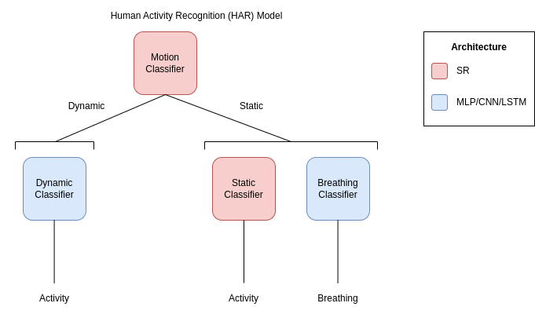

# IMU Activity Recognition with TensorFlow

## Structure





##  Installation
```
conda create -n <env_name>
conda activate <env_name>

# tensorflow (change to desired version)
conda install tensorflow==2.11.0 

# data processing
conda install pandas numpy scikit-learn tqdm

# config, logging and metrics (not on conda)
pip install wandb yacs --upgrade-strategy only-if-needed

# for fully functionality
cd <pdiot-ml_directory>
python setup.py install
```

## Training
1. Format activity classification dataset. Example scripts found in `data`.

Custom dataset files are expected to be formatted as follows:
```
{ 'filepath': <data_csv_filepath>, 'annotation': <label>}
...
```


2. Make configuration YAML file. 

Example `mlp-motion.yaml`:
```
DATASET:
  path: ""
  num_classes: 2
  LIST:
    train: "train_motion_pdiot-data.odgt"
    val: "val_motion_pdiot-data.odgt"
    test: "test_motion_pdiot-data.odgt"

MODEL:
  INPUT:
    sensor: "all"
    format: "summary"
    window_size: 15
  ARCH:
    LSTM:
      num_layers: 0
    MLP:
      num_layers: 3
      hidden_size: 32
      dropout: 0.2

TRAIN:
  path: ""
  DATA:
    overlap_size: 5
    batch_size: 128
  LEN:
    num_epoch: 100
    early_stop: 10
  OPTIM:
    optim: "adam"
    lr: 0.001
    momentum: 0.9
    weight_decay: 0.0005
  LR:
    schedule: 'step'
    step_size: 40
    gamma: 0.1
```

3. Run the training
```
python train.py -c <config_filepath> -i <train_val_odgt_dirpath> -o <checkpoint_dirpath>
```

4. Results are stored at the checkpoint directory. By default your directory will be set up as follows:
```
<DIR>
├── weights.hdf5            # checkpoint with best validation accuracy
├── history.csv             # training and validation metrics history
├── config.yaml             # configuration file (updated with train.py arguments)
└── log.txt                 # model training logs
```

## Leave-One-Out (LOO) Testing
1. Format activity classification dataset for your test task. Example scripts found in `data`.

Custom dataset files are expected to be formatted as follows:
```
{ 'filepath': <data_csv_filepath>, 'annotation': [<motion_label>, 
                                                  <dynamic_label>,
                                                  <static_label>,
                                                  <breath_label>]}
...
```


2. Make configuration YAML file. 

Example `task_1.yaml`:
```
DATASET:
  path: ""
  task: 1

HAR:
  MOTION:
    config: "config/motion.yaml"
  DYNAMIC:
    config: "config/dynamic.yaml"
  STATIC:
    config: "config/static.yaml"
  BREATH:
    config: "config/breath.yaml"
```

3. Run the testing
```
python test.py -c <config_filepath> -i <test_odgt_dirpath> -o <checkpoint_dirpath>
```

4. Results are stored at the checkpoint directory. By default your directory will be set up as follows:
```
<DIR>
├── history.csv             # LOO training history
├── result.csv              # LOO test results
├── confusion.txt           # LOO test confusion matrix 
├── config.yaml             # configuration file (updated with test.py arguments)
└── log.txt                 # LOO test logs
```
